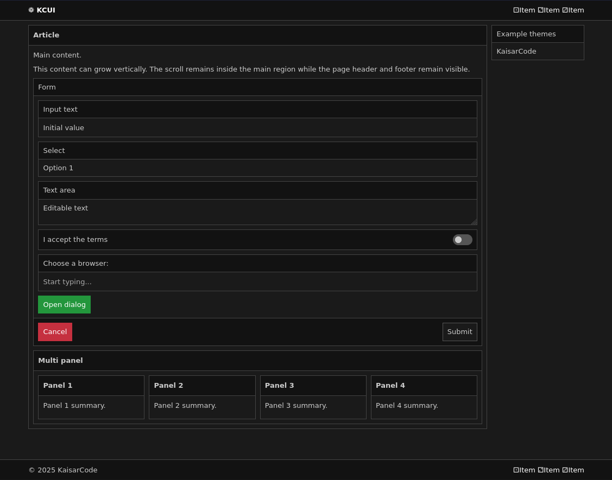

# KCUI

Minimal and responsive CSS framework distributed as a single `kcui.css` file. KCUI provides a compact structural foundation rather than a finished visual system: it keeps layout and basic controls predictable, accessible, and easy to inspect, while themes and project-specific CSS define the polished appearance, branding, and higher-level experience.



## Features

- Grail page layout
- Flexible rows and 12-column width utilities
- Automatic grid and masonry layouts
- Panels and reusable header/body/footer regions
- Styled native controls with reusable visual aliases
- Dialog and code styles
- Optional extras
- Semantic color utilities
- CSS custom properties for theming

## Quick start

```html
<link rel="stylesheet" href="kcui.css">
```

```html
<div class="grl">
    <header class="hdr">
        <div class="wrp">Header</div>
    </header>

    <main class="bdy">
        <div class="wrp row">
            <article class="pnl col10">
                <header class="hdr">Article</header>
                <section class="bdy">Main content.</section>
            </article>

            <aside class="pnl col2">
                <header class="hdr">Aside</header>
                <section class="bdy">Aside content.</section>
            </aside>
        </div>
    </main>

    <footer class="ftr">
        <div class="wrp">Footer</div>
    </footer>
</div>
```

## Variables

```css
:root {
    --fsz: 13px;
    --pad: 0.625rem;
    --bdw: 1px;
    --rad: 0;
    --min: 360px;
    --max: 1024px;
    --col: 12rem;
}
```

Theme colors are also exposed as CSS custom properties, so the appearance
can be changed without modifying the structural rules.

## Layout

### `.grl`

Three-part page layout. The first and last direct children stay in place
while the middle child fills the remaining height and scrolls.

```html
<div class="grl">
    <header>...</header>
    <main>...</main>
    <footer>...</footer>
</div>
```

### `.row`

Flexible horizontal layout. Direct children share the available space
and wrap when needed.

```html
<div class="row">
    <section>...</section>
    <section>...</section>
</div>
```

Below the responsive breakpoint, direct children become full width.

### `.col`, `.col1` ... `.col12`

Width utilities based on twelve proportional steps.

```html
<div class="row">
    <article class="col10">...</article>
    <aside class="col2">...</aside>
</div>
```

`.col` is equivalent to `.col1`. The utilities are layout-agnostic
and can be used with any element.

### `.wrp`

Centers content and limits its width to `--max`.

```html
<div class="wrp">...</div>
```

### `.grd`

Automatic equal-width grid. The browser creates as many columns as fit,
using `--col` as the minimum track width.

```html
<section class="grd">
    <article class="pnl">...</article>
    <article class="pnl">...</article>
    <article class="pnl">...</article>
</section>
```

### `.mry`

Automatic multi-column layout using `--col` as the base column width.
Content flows vertically through the columns.

```html
<section class="mry">
    <article class="pnl">...</article>
    <article class="pnl">...</article>
    <article class="pnl">...</article>
</section>
```

## Regions and panels

`.hdr`, `.bdy`, and `.ftr` provide reusable regions with consistent
spacing and theme colors.

```html
<section class="pnl">
    <header class="hdr">Header</header>
    <section class="bdy">Body</section>
    <footer class="ftr">Footer</footer>
</section>
```

A fieldset can also use panel styling:

```html
<fieldset class="pnl">
    <legend>Form</legend>
    <section class="bdy">...</section>
    <footer class="ftr">...</footer>
</fieldset>
```

## Controls

Canonical HTML controls are styled directly. Classes such as `.btn`, `.ipt`,
`.dlg`, and `.cod` remain available when the same visual treatment
needs to be reused on another element.

```html
<button>Button</button>
<a class="btn" href="#">Button link</a>

<input type="text" placeholder="Text input">

<select>
    <option>Option</option>
</select>

<textarea>Text area</textarea>

<dialog>Modal content.</dialog>

<code>const kcui = true;</code>
```

Checkboxes and radio buttons have their own base treatment. Specialized
controls such as file, range, color, and date/time inputs are outside the
core control model and may remain native or be handled by a theme or optional component.

### Form composition

Existing regions can compose a labeled field without a dedicated label component:

```html
<div class="pnl">
    <label class="hdr" for="name">Name</label>
    <input class="bdy" id="name" type="text">
</div>
```

### Extras

Optional extensions may be provided under `extra/`.

Extras are not part of the structural core and may extend KCUI with
additional presentation, behavior, themes, components, or other optional
functionality.

## Color utilities

Semantic color classes apply text, border, and background colors:

```text
.prm  Primary
.sec  Secondary
.inf  Info
.scc  Success
.wrn  Warning
.dng  Danger
.wht  White
.blk  Black
.sys  System
```

## Demo

`demo.html` contains examples of the current KCUI features and usage.

## Beta Notice

This is a beta project tested only on Debian x86_64. It was created out
of a personal need for these libraries, but no guarantees are provided
egarding its stability or future support. You are free to test it, use it,
and modify it as you please.

If you'd like to reach out, you can send an email to kaisar@kaisarcode.com.
Please note that I do not accept pull requests; the goal is to avoid
long-term dependency on platforms like GitHub, and I do not maintain fixed
infrastructure to guarantee long-term stability for these projects.

## License

[](https://www.gnu.org/licenses/gpl-3.0.html)

This project is distributed under the **GNU General Public License version 3 (GPLv3)**.

*2025 KaisarCode*
